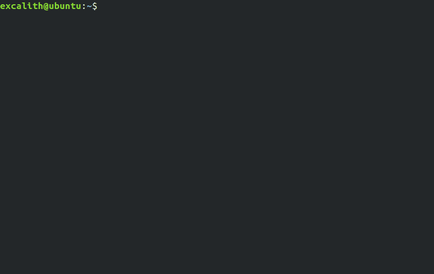

	<h1 align="center">Git Cheats - <i>Cheatsheet For Git Commands</i></h1>

    A companion app for <a href="http://gitcheats.com/">Git Cheats</a> where you can  fetch git descriptions directly into your terminal

    

	
	
	
	
	
	

**Git Cheats** is a small project for people who wants to get into git using commands but don't know where to start. It started as a side-project to help my friends / colleagues check commands easily, but it turned out it has been shared through my friends lots of times and it is being used on a daily basis. Suprising enough, I wanted to create a project for this. Maybe someone finds it useful and / or wants to contribute!

You can either use web based [GitCheats App](http://gitcheats.com) from your browser or use this GitCheats CLI right from your terminal.

## How To Install:

### Using NPM

`npm i -g git-commands-cli`

### Clone

- Clone or Download this repository
- Within the directory, from your favorite terminal
  - npm install
  - npm link (might ask for permission depending on your OS)

## Available Commands:

| _Command_                  | _Description_                                            |
| -------------------------- | -------------------------------------------------------- |
| gitcheats                  | Launch gitcheats.com directly                            |
| gitcheats [command]        | Print command descriptions right into your terminal      |
| gitcheats --open [command] | Open gitcheats.com in browser with your command filtered |
| gitcheats --language [key] | Set your preffered language (Default: en)                |
| gitcheats --version        | Shows and checks version                                 |
| gitcheats --help           | Show commands for the app                                |

## How To Contribute:

- If you want to add more commands into GitCheats, please contribute to original [GitCheats Repository](https://github.com/excalith/Git-Cheats).
- If you want to further improve CLI app, please send a pull request to this repository.

## License

This project is licensed under the MIT License - see the [LICENSE.md](LICENSE.md) file for details.
