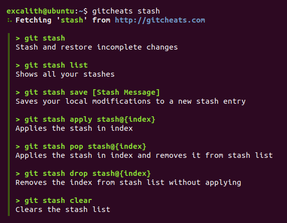

# Git Cheats - *Cheatsheet For Git Commands*
**Git Cheats CLI** is a companion app for [GitCheats](http://gitcheats.com/) where you can directly fetch git command descriptions into your terminal.

## How To Install:
* Requirements
    * [NodeJS](https://nodejs.org)
    * [NPM](https://www.npmjs.com/get-npm)
* Clone or Download this repository
* Within the directory, from your favorite terminal
    * npm install
    * npm link (might ask for permission depending on your OS)
* Now you can use gitcheats directly from your terminal!

## Available Commands:
| *Command*                    | *Description*                                              |
| ---------------------------- |------------------------------------------------------------|
| gitcheats                    | Launch gitcheats.com directly                              |
| gitcheats [command]          | Print command descriptions right into your terminal        |
| gitcheats --launch [command] | Launch gitcheats.com in browser with your command filtered |
| gitcheats --help             | Show commands for the app                                  |

## How To Contribute:
* If you want to add  more commands into GitCheats, please contribute to original [GitCheats Repository](https://github.com/excalith/Git-Cheats).
* If you want to further improve CLI app, please send a pull request to this repository.

## License
This project is licensed under the MIT License - see the [LICENSE.md](LICENSE.md) file for details.